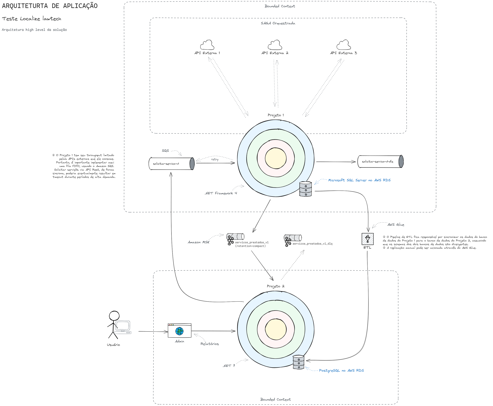

# Localize
## Teste Arquiteto de Software

Teste de Arquitetura de Software da [Localize lawtech](https://localize.com.br/).

## Stack

### REQUISITOS

*Por gentileza, observe os quesitos abaixo.*

*Projeto 1:*
- *Stack: .Net 4*
- *Banco de Dados: MSSQL*
- *Gera dados de serviços prestados*
- *Possui consumo constante de informações de APIs externas*
- *Recebe pedidos de serviços do Projeto 2*
- *Precisa de manutenção casualmente, ainda recebe atualizações*

*Projeto 2:* 
- *Stack: .Net 7*
- *Banco de Dados: PostgreSQL*
- *Consome dados enviados pelo Projeto 1 para gerar insights e relatórios*
- *Precisa sincronizar dados do Projeto 1 de forma constante*
- *Há como solicitar sincronização manual com o Projeto 2*
- *Recebe atualizações constantemente*

*Ambos projetos utilizam a nuvem AWS e seus serviços.*

*Com estes dados, responda às seguintes questões:*
1. *Faça um diagrama de sistema para uma forma de comunicação entre ambos projetos.*
2. *Quais ferramentas de observabilidade você usaria para avaliar a continuidade da comunicação entre os projetos?*
3. *Qual pipeline você usaria para o Projeto 2 consumir dados do Projeto 1? Justifique.*
4. *Qual prática de DevOps você aplicaria ao Projeto 1, baseado nas informações atuais?*
5. *Sobre DevSecOps, quais práticas você aplicaria para sua solução? Explique sua resposta.*

*— Fonte: [Localize](https://localize.com.br/)*

## Documentação

## Arquitetura de Aplicação

Arquitetura high-level da solução

*Clique na imagem para ampliar.*

## Arquitetura Cloud

Cloud provider: AWS

[Clique aqui para ver no draw.io](https://viewer.diagrams.net/?tags=%7B%7D&lightbox=1&highlight=0000ff&edit=_blank&layers=1&nav=1&title=arquitetura-cloud.drawio#R%3Cmxfile%3E%3Cdiagram%20name%3D%22P%C3%A1gina-1%22%20id%3D%22QyuDZeAoyNbm0Pvu70TN%22%3E7T1pd5u42r%2FG59z7wT7sy0fHSdq8Taa9SduZ6RcfDLLDFIMHcNL0179aEAZJXpKAwYl657ZGbEJ69nWgT5a%2FPqTe6v4mCUA00JTg10A%2FH2ia6eoO%2FAeNPJER1XFsMrJIw6AY2wzchb9BMagUo%2BswAFntwjxJojxc1Qf9JI6Bn9fGvDRNHuuXzZOo%2FtaVtwDcwJ3vRfzon2GQ35NRR7M34x9BuLinb1Ytl5xZevTi4kuyey9IHitD%2BsVAn6RJkpNfy18TEKHVo%2BtC7rvccracWAri%2FJAbrq27s4fltz9u0uCj%2FuHicmw%2FTofFUx68aF188PjPOzgwiZJ1UMw7f6KLsUrCOMcLap7B%2F%2BD7JsrAhGcm6GikmcwAe2zXB1T%2BCD2jPsAe2%2FUBlX28yrxfZSdYGeCOao9XmPcrlQnC%2F%2FSzZJ1HYQwmJegpcHCRekEIt2SSREkKx%2BIkhqt3dp8vI3ikwp%2BP92EO7laej1b1EeINHJsncV4Av6rR42Lh0VMheOcefFdaHOOdAOnFAyAbQq6JIm%2BVhbPyrhT46zQLH8AtyMjD0SgExBX6vfy1QEg78h4zY7RIk%2FUKT%2F8Kvkt4dgp%2FTn0EGFMvytGD8jT5CeiHDjQd%2Fu8SAd%2FZPIwiOh6AubfG1z%2BANA8hao2jcIFekSfojV5xFIE5fihcmDBeXOOjc10pFkP0lsDL7kFQfBWPDhS24VvBr8pQgR4fQLIEefoELynODlXDKJC1IFeWUhw%2FbnBfd%2BhF9xXE18tLvYLiLMrnb5AS%2FijwUoyj3g%2FbtsL0x8VNkvxlJENVn%2F0cGhweggDSqOIwSfP7ZJHEXnSxGT2D%2BxUH5dpsrrlO0JpjMPwH5PlTAXPeOk%2FqQDqPksdxHEIqFmJwUHctcZasUx%2Fs%2BAStoNxeugD5juvM4kL0gTt3LAURnNlDnUiLVr649QvCl8pO22Z9ox3Trj%2BDTLW4jdnAch4v31OTo7vnV%2BMPt%2BObMRw9v4B%2FjW%2F%2F9%2B3q68XXb7doaHL9%2Bds5BwcQrvP6tjHIxGLcMgwCDB8iGlSHmSoFQk9G77qjLExlSJZVHF96yzBCS3q99sPAQxNP4izBr8yqNzeBrZrCYavKY6smQta2UNXitnUSIWYAD9AuXidwL9CSaUrkPebAvx9oFiaNQfgAfy7Qz%2B8gzQYTfTDWE3LXgzJS6XVwVpVLXw8QhAQfBg27Nred%2FTQO3E%2Brrf10uP38EOYf1zNu4em6XnszEH1JsrAgm7Mkz5NlfUt2s0EfgUvKcddCjKgyVsgKFeXs4lIT8fTf6xSMFmF%2Bv55NfSiWC2SGhvBQs636tmmmanD7Zgq2zWyNY3bCMuESpk9%2FFffjg7%2FRAZQgi8PzX9WT50%2FVoy8gDeHHlwJes%2FyX8tW9DJiqXa0zYMtRRkrlj1kDIddQRWfp88n3csx5nKbeU%2BWyQl3ZPgmj%2FlLHYCCPPLBZxq9xJOXLehaFPhy7QugZg5wD3uwnyP17CpkirWObiLxFG2HICL78fBvNqYnZewndgdStKmru0X28bEU%2BdB7%2BQvMQEjKxUhMls8a4k431ywq8lKyoQuYMhydzdKx57uR2SubUJshcHRADDzhzX6RaWr4DZvNXEUHnQBpoN00CX7XJKjU1VSiGQGqkQ1B9jmsgYf27Rhams5nn%2F1zgzR%2F6ZFmRbBnGEIG9iDyguLJ85KUycC8H7tnAcSryJ3lDe2%2FVLG%2BJSEY8y9A%2F5Pp56gEIE%2Bt8nSLBMwAPSIjOIBxpygJAWPBDD4ukKxAl8J%2BvAJLueZIu0UYSRM8goSLXxOgKIsiN9nzYLGVHWAn8KDuxazaiaXcyyV6Ay2dEj5P0J5KfMKAgNeUKzmNyXt95pGL7iHlBAUGZe78R7q5WEULsAF21ijx8NX4C%2BAX8NVbKbKqaFZdVAQ3qTfDkmZ7h32ny4HG3IPD7clsAJVwEdEaNwgy%2FJMvJMeKfG1C%2Bg2CbYntsi8D6kltr%2B618xhvq5UC0MghfU%2FJxJdp66dL7DSBKJsVylHiciPGYW4PnacJ79aliqCGNOWIEpFLy2SZBlbaZgw0pTZk9OcXb1njF21AEGpymu22xPfrkGttjNrm%2B4qI9qex%2FAyul6oyqaxh0mpWVUhWRgbi0Gje%2FVPTJjS0VI5XNTfQ%2FXssgf4TSGv7T0KLbljaqS96GqfHLDkfpZTXbkN3euvPes49JGv5GvhqI2cEYys4ZciWmPJn9T%2BwtC6sg5BRQ4k60%2F24nxhVKtwzjW7CCCiP6HnT7Vtsgf6v3i7kV4fRB5JTTwWoqaQV0asoiBrOM8XQxqqdjmxeaCIbm%2BA9V9ypexxG2B0yUkaUz%2FsXChciMusJR4opkrnS3PNjGd8PzgoeozJjmMNdiXyGrn%2F5cz7CuD7JR6CcxWoHNEGYNxYKuqEPufuW9hK2Uijmngos5WxMYa%2BoMmXRdHl9FFsHWVGXV4O0ukKPOw8UNhMpDsBMKpOjy%2F0rU6AA1SiTwlyeLA5bZOQ7o7coJr7HePEcecNSRqjOLKxIIlI3JrrbALUoEBrfCf0BKQvD8QBlAkpe%2Bcd44OxWi43D6idI50eFDHQoh9A55OlicSGsCqi7RoX%2FokJ4uOpjdy6F8iAhjOOXMmVV0IebIGM6GvXKvbRUp78N5YVdCyPURRA8A2xrR3QqymA2LzUGny%2F2h5wjejPH7Cxzi7bGUkW03VdZnjWyC7hbj3zn88ORpCeLywyErXSblAihRskBHnh8uvdF27bkywtssK1rAKxZ3%2BwIpr1j3Zy5uoaJUbKsY0NKQWF4fQJjRj%2FSWMxKXBOe6MU9nICahR%2Bf0WvQED4NfzZT90sWu7egqCTZOHIAMJWT370sbypJMcYImsYbUw0OrVhks4GSr0UXxE2Q4nnnYvh576JOWBOTyFHMZtD2Q1CEbKzrAfuWYvoI%2B%2Fwagq9H5O5BC8jPiuNLrrc0pIT7vwNxcBsrusqHaojCvFq3NlOAf2ZX%2BK8xxwBBm%2BOSYONMtvTjcONPRwVPlgHWlb8KPsFxS882Tx3Ubg6RSRrs%2FCMksZMaGo5CeGx%2BklrZjCqpOocNfHnyHrbkMdLYQVKQa3USCSPAVXmmpbwZ8qeG2XfA1eQcW4rTh4UYT9qr8aQVozLUXQC7rxT6SCKQ22TdtMnvwT0Wd5Ey6jsDqeFx10lQ5mJaEvzu5xWma8L8SOninV1UDk%2Fbo0ySZAd7DU6GavBGuc5u02bIjrOOAGUdjwmVs3eZWXBVp2O15xkzeM1Zas%2FQxpIYo%2BpHdA4oqkJQjgro%2FiWov3GOMOSujTBljDH7PmBI4Ye5BMZXz%2BzxfESfFJfzPD2IVY%2B88hECTjrDd6TLwcg%2F%2Bg8ahmH65jvGvIcreGD4k0RBC4aVmoAsT%2FydIh6rmjFbxohmksxgQMHgQ0AXJCnp7SMc7giRz6R9zWSXByXIWq3P3jilw77wlzqIrbCimY%2FFrfmzewmfISN7SIm%2BxVQ4IbB4Ijsxd%2BFRtyV0kd3kVdzE5MO%2Fe3tN0VkTP%2BItmjhjlxVQE6uKRGYzF26clg2lVeeGhQO2aw1CvjuQwksM0pr%2BwcG64AnH6uCzG4o3Gn76dXdz%2BcfH1ApUGvP784Woyvh6gElWTj1dfLyZfv91ecKjQXkjMc4tYPaNGFVv0qumaVVympWGIKsxZgg1vIvZlevtX8GmyiJ5icHf7NP%2Fbmfwwh6pApKhHbuEcbMQ6SCrvAFfbLMoRQkZcCeGr5eA%2FMw27jClrKD35rWa4b3nz7sT3jGSmw184lR2xdoVkt2NXwvZIvwGT1k6fwF40w8CRrX0QEKTCE8iTIEG34b%2BQlASyHaGDJ7LxGB%2F25O6jQMaDAmB9srZBuEiGiPqAKkbNQZjvrQQg%2BHSZG99UsKLGVgSFqpAo9VhAsFW7AYr97%2B3D92gG%2Fom%2F5NePZ9nNx78%2FzIc8g%2Ba2mJRzPfj7y%2FrJ3ow%2BQdm5LkNuXVy%2B5pvquiOqsNZWprVSqbyI%2Fi0jpEpNwyTjdbS9hbW2FdCqq8emYZ5ZxiGIBC92bFd1LVYJ6ENhLWERLTj5NfwsHEwxXWcAp3%2FwJbg4WNsJuvsRsFZQQYRerQHRAegl4eaZcBMAFM13HMgpzrp1AqXycraqiOmT0wBkCb%2BB94EjZdbPo90AJiy7zmjTIj1dNGbzgyp%2FmUhfFynxojGbH1T5y4ixwRQMisZEhePZu1XB3Spz9%2Fay7dsKKDI4OHE1UyAxVe0wp4GdKSCBb8RqcgYPRXXf%2FWS59OJgitZrivF2jsW6durGqqZNLe7VwkOiFG6zJQw1OUw8Yjgl%2FV2pp7g9krIXxWaFPSVoimM1XnIXOTx%2BtKRwNrznfvzlKsP6Lk4K46VHgUX%2FcLPiFmN%2BlZKIaQOhPLQZidAmrCiOcqmw6lCNMLFEAUrHNjaxZiPc4mGXltYA8g83Lpzd2C%2ByfbZWvl1V%2BMBA0g8F4fuA5P9hOYYFBYGuzO2KObYmTk1%2B2%2B4LYok6KzfSR7Vf80xj9skRVL0tJabaLmntbdMBoWRvd0d0dkdsfkdEG9Ii3tg88bxDvWfCHM27Yox45gadn%2BsmWoqX7Ul5d%2Ft7YjJ7AkkwvymWyEzUXt8Yp80o52LHmlg6i106gYXNFLlEzPYojNaJINi%2BHCb8WlfrShDbOe8%2BVf506jCq2gIuqJqiqBS3CSAVrpN%2BgKHqhGOBmDIBmoiiCj2lRhOVVoUrzi%2F4eOn9TpCb6SLyshx3cfhUxidsBEb46z8Xn%2B74bCpp5%2Bmnnefi3EYA%2BF7sPOBn1hCdNFlCKcBakRjUHs7yugKECLir6E5U5B1wSCmjuDqP4vLJFk3JBp1GPJfGFE9QXYFi1lYsl1hCaFoDaEHcF%2FJ1jXbyOxJf5xNI%2FsDFqSRh6K7Ub0y61p0C5ls6myrQPe4LtP9bsAixsDqwUfW0b9iw6aHQdeU%2F38N0Ecah99%2Fy9DobAniSxlTINtCsSLtTzmy%2FDbQ66KgNdErASOh3GBtjS2wpaqj5s2rYF2dj1mTbAA4PueYeqi7KObCEptVGrHhiPOblV%2BKSGPs%2BZN183onEzj5gp9IVdnoFWAjQc3KObNCtomf5ihZ6szMGodKaXsVOWxg634ihWIidqtpHYyUb%2BuRqUFxUeSnbKRN5G%2FdIiFdLUJCo89VyWUe0IggV00SmXaOJQDHxQtHXvU3brmubbDNVTbEFAcRtpXluWXQ%2BfFimebaX5qmoFg8FjsYT9ZbSPLcAwZv2qogwT3V5endszDvAUCWNL51bZU8nt9Y1DTa1VivT%2BLsyyaiaLILWNYNRXadrBnNA8NrbYjC6wq%2F5sRkMr6ZJzDsu5ulUVe4O83g3j5QypJTRrJSh2TyxO7KUwZdCu5iggas4y1EdfJ7QySgkxrwso5AGHUQh%2BVozeAn5j8HyH6jlCiKRNAFiaq0h5gHF2yT%2FkfznVfxHMXg76nH5j9607boJisCmMfXIJ8IbBXqwXKbC22Z74BfRm16sXinPEHV66RjReZOF1J7b0551o4%2BOEf1tlzYXoV4PPCO6tFlImbFJmRHSqT66RnTeaCFZzHFZTPeuEf0ABfmNsZge%2BEYMXl%2BTqHdc1OveN2LwsU9SzpByRsNyRvfOEWrdlc4R6Rx5p84R3eijc8SQIYCSAbXOgLr3jtAJvI2O3bV%2B3eqg89qTamEuq9Y82pK4U1zZXNEjfOs4Tb2nygUF2dg8%2BQsa2ECpweTqoFzCKpDtv4G6prbd4FrmzhvgDzLpDVCXX%2F8aOO%2B0lKqE89Kmor4TOFc1txNAFzQTl8UjZPGI5xQ6Y0MTnK6t8YJe3RKmJUw%2FQ8fUufiRHoC1Kp2pvQDpPTomOh2BvAE4dNkuRYYghunIMCgbVZ8EDE5XafLrqRn%2BbvYOCHlHa1m8JODA8Wi%2Bviocvh2Hn2JzRIj3ghy1JmapFEoi1G8i1BgjVNnilBAIu7aEHlK%2FWgJh90DYHCfUdT4ApgdwyBtwJDNsixmyVbw0g2J9Z8zQsLlNPkavByY0bT7XfF9EjwJrZpmWwIJcN1EPXt8GbOv%2B7jdHU4Fyb6%2BJdrwuvDHYZc3HpskAEJlqcd8Ghp5r2FYV7k3GHkO1w%2BLA%2FjtY7m0WoZIt%2B3CcLjDjpTDdIEY1iBmUu3SEGc8GZ4Mth%2FcC4Kzf0ZbfpROyLR2M2wxab9%2FBqOi772gL0LuhwhLQt%2Birbx%2FQdUvtANAFRQChrs9rYNIm0LlNAO%2FLibgimY5Emk6peFcGB9pyfpfdC8QBxDDcutePvCwL%2FTpo18l7hby6dZlZewmB3ZB%2BCD9Vyu%2B6z6b8HRFrSkv20uo9QEDHXqmOWhwQsuYM8umcNso9yWZ1R809TK99AZV2ja%2Bf%2F2%2Fx%2B%2Frbzz%2Fyx5lx%2Fvtpfj%2FcFhmifBB2eZXdCPrQjaCzXiHA16ZhkVkzRTMiLxd0%2BnUsS9UZntxsb4LyFU33JjDVOk5uDDzVpE5FRF%2FsJtI6heYEq5s48y2C%2FobzHEPQFy6IKWiHu7uA3vH74Yp3sptI6rewkzRdqS87yUt%2BY7TwmnIHyVuIPCyKuFm6ZKNvm41OqB60s7UPhJVpRiBluuG%2Bd5iXFtNrkLGWutlePqpu%2BO9XTF40syHOylZtcwRNfzZ2uRpnba%2Fvdg8LtrFdNftT3o6vGjWJknUAh4oerxGEMU1ZerG3QL%2Bksadvxh5%2F6k%2FLOIWeW3t0x62rx0rnlY34mPPxlysE5CB9kADfR4D3VuGpgrvqWiKyf1z75gGZ%2FMcIsOnITWR1pXKIDaG8sHLnQ7qxjiTt6SPtyXy8sKdJfbp3rRwgmr9d0kNxvSekR5DpNJEi%2F0lQodMR%2BDn3bucCv3lAkukz3bulP5YG5lScuy%2BNw7FL13DVt3sqsTiHWuiP494dMg6gzYOf695l81U11jDTnHd3S7AZXwyUg96jG7dcQVV8UTMCdVPwqYbqttsSrjtvuia6ZfSxG4GgUqksV9tawo7l9LEXgXJAEv3bwrsetCJQDohbk7J757L76VRotLQ%2BdiJQeQlI8pej8pfuGxGoB9RHeFv8pQd9CFTebyAR76iI130bAlWTMoaUMVqWMTrvQiDopyebEMgmBO%2BoCYHl9LAHgSHLQ0rm0zbz6b4DgckrN7K4ryzuezhU25z62IPavrxIJQG6f7S7uYqGFutzLQvXdCbVH%2BAMlCDYPQg2Vs%2FQsnn23jkUGrxrTFYzbMmGZnPlxTVeuDtuMUPKB2WxoG4DlIptePO1gizd3HlDWzWxLAnmPQBzvfFkh76Cueu2C%2BbCWiu8Q4zmTkIR5iEMcBg1ziZjcEHAxg9XHA%2Fg4GLZgIiefxasTyiMKoqjXBap0AGOf1VYYZeV8MIkszHTz0Y%2B%2FvodWnIDPJ1NalCdA1VbvQGeLoSCjhtG1gjds6lcw4RJUPlhF%2BYcPxNCOBtBtBpEAvdy4J4NHHhSuVgSnA7Wg4k%2BGNv4bz1BqhD8iAx%2BLlgmkAAq6zyMwt9eHKCiEej%2Fq2i9GIYx%2FIWLME3%2BuMJLG6TlI5TAQ1TizzssRiuf0cHS%2B52ge75%2FmWxugk%2FCD5oniKx82ihWA82KUImdGRy3FjneQW6k%2FkGfVzkI0UPxs9bo8%2BplopQYTY14vQIAaRk69NBf%2FjrDJTGWXoi%2BeOaFv9Dhv%2Bviq6HQD0HHIzegVVgxa1Zk1kYgy8jXxMAP8SKsQJQUa6EplxCGvBw08HVkT9JiR8rFvZjckumSWdMyEppyCxZhRuAPfQn6jhTeBGL8DLRICwBxww%2FxsYe%2BAutDSL1R8Hd%2FIXER8Jf2kvmjpUJkToErg1YJrZyahuh5uFhTVH4MC153V3QKZBHvgJ8CxJqVG5rNQ3b2k5NVPg%2B9BT8TXh3gL8N7m6FPQi8%2FfwB4wMtT7wGPuBl953rp4RelD6EPxr4PKVtOEMPLsvUyJFBBrkqTCNAJXo1vyrUJwoeDF2dM2EVWQaCkhg9oj7bhq0ImX4Dmg4qtGOSFSAGtToOh6ZA95XUSXGeeRfyJoIoHUwhLzJtF8Ul1JvFs0%2FMyDALMbJDH8dJbhhFiBNfrAtkmkGMn%2BHyN1zfAolWL0bvhgFpaYqqxK6IAJsN2SvN14xV%2BBMn%2BJTmIvAyuI1kZAS1gLTPS418dkx7%2Frjz%2BDcnVm8jesky8ymOsIYg2a8JUKq4jxutXWCBiMFHW3upD7a2SDB67hOXDyheqss7EuLy8FLPkhipWjsdn9pnDUpQGkBEFWjIs1BCouXqJs1V8RM1VXo%2BRWwr2uZ0ou2%2Bp4wgllyfScMTm2MIJts8RV3vUu4Xl063bqTfuPXmVnKBq3VClTRn2qg2Ontpig%2BvF9osJUzvOAt64z1KUksQ0n0QvhBeHj0UaP3ghVLDDKMzRF%2F5AYgILUgI5gmMkqmFfnI0HTO1NsbjBSlOMcFE%2Bqv0E%2FtKE%2FkTlCipBVLP3FZGs4TRgVRdvEh8F%2Bb43yVL6t0mmAJOw3ZGUUPzg5eDRk7aTU7GdlCrT%2B7CdeKtwuihAtBnDp6KqXOitLsiYPq4ZhY973Ng6rxMvgP%2FAPUF5TalEVYmqfURVQAB2GkFwnc4wsKJy%2FO1hrSVKdjoq1nbc27V%2F2qnJa6c76V1PtFNBxa5JsohD5B6WxPYkiO35uW4Yk3dDbP0CPJuhrprLFTLoXiai7z8NO3avqKvSK%2BpqC8wE1KN%2Fe343KGNcIBrmixTc%2Fe%2BajzC5gcKFlH1PhhxPXM0UN9N5k%2BQ4DbKGLEh8Yqiuq7wRaVcl1tcg8PT2r%2BDTZBE9xeDu9mn%2BtzP5YZalYk%2BDEjdLdGmK5F6iqyo987jwMu0txGgU22fyXjVJR%2FtJR9%2BZDSFFEDo19WaIqcYUNne7FmkFpbn%2BHF9KZDwRZHxnOuajN28GD3Wa40bxUNE6xkNeI8FZYZdpEgvqI0p07CU6vjPeiDP35hhCG8HKMtG%2BL9zR5p1ggtwYiZwngZzvjFdmBFCntCFTIxjqUosftQQ4Ao9XW5YAMYry9eslikoUfb8oajC1O1TzwOL7raEobSxStftgI%2FvNOsrD4fgH%2FHkOP12ZROv9JvVnwdeWDJbDTMPFxb2DODZhRt0KhQGELbTGU%2B%2F3NJhN%2FWJ9mwn%2FpKURKCtQBM1M2iqTJIYzvk%2Fk8706twCHNqVgFcFtlJzjRDiH9O68VKDjqt0d1buzxSjZTSGoF4YxNevecQtuude943RWDmXnvDku%2F2VTmFHy9EZ4Oil12QwXV%2BvIrzkHlrpsDfndvXV1ULGbmRf7uIoHrgziBbiOzooUo8lwDQZcTCuDO0mKyuDiHui5gnwQXJUknKPyLLgSCCpDgqtQUjEgwz%2B9YJjE0RM5j%2BSIebikU1hAySLOw7Q440WoeiV8aLZK4hC9DM7xZVVpBrTIxMTz79GrSCWfWxCE3DfjIpqLdVFHh3wCmgd4CH0M1Oh6%2BEHow68vv8G%2Fh%2BgX8FAPHuUyBf%2Bu4RKgT1S%2BZSDgPxNqKlhAJ8vpFzPCi083gZSFIb%2FJDIqaP3P0eFxJZYxqxbx0MT7dIKJCa%2BsUU%2FTvvQdAJ%2Bmn4SpPIM7MQ7wJaC3OqvByXkwP0ye0mbQyD60nVNRWeukUt1fRYaadgfi%2BnOI6W1dr9iyL8CJyUgTvFTBNILgxNWsQf1uSB%2BZYkiX32nTzbAyfHioExZBmWbTmGXGKbH6VIgwBF6lBljsy26KhvFFsgpZuDhcPx1tIw9hpqTfvzDDmb4CVGsemDUVgGJpWQ1jrwEKQ7Sk7isqhYYfKznEL1e70he%2FVgCiZ64kGpCq8AeruPgRRIOmspLN9pLMZgc6GQmoYv4NIEjqyGYkPOBVI6zjeTfH%2BWQdULC%2B1HDxADMFcNVKkZiHaQ%2BRwog8l8T%2FrON%2FoXpWSmgUdmGC6tpyRipJFwckcLMDOt%2BGSWehs7kENDakU5%2BfJnZTcXwGups4lGIlMH7qil%2FbRKtCqTRSGFkOtznMRrPNKFiJZSP9YyE%2FwVIjoSziTaUYq%2BjaDo4JWPN0HnKiUz3VVN8o%2BtbpRO70X%2Bwva9SsxW9U7blJycmXDXrf9JTvsy%2F5bJ%2BWb7JO6TmMHe7OTvJWUCOs48v5PD4lXUuo6ntQll7M3QuyFrZr22bsRYnEiwyNC%2BKnWjOiqqSbTW0p3DmsR3Z7gSuvldiO50N9%2F14XYfZJLjdkduebFzoKn%2ByUXq2fmaWru4PkdDhuQvE7yulNdTsnrnlGnCSN7Q1yOabno0ODuzpgcdefutvkzlWYtb4m2KJ5l6J%2B595ta49c5XByBQZ7ED32rROyUDaSEToCydhvtHAaffJ%2BkcMvTI1rxSwh9S4Z8VWHqUKuqKG1UVOK4dBC1AIbqQWBI0xM%2BrL00OF%2FjiMRlgkAlLUPbCt9PGWj3mKQ%2FUUXLSiu2AEo7fk4ay0FBAgcbotNLLxqiuNLYx3GQXgmkOViuEix5eFEbAJiSRX4HfiSVbXVhi7xIwo4rTbiQfPDXxffkr%2BvbXEl%2F6J9v1eVwLCq0IwA%2BCmfIbl82xKMpQrTXHxiw%2Fspgl1M0xRGXc0BoXVzrnFi1qijXyaKVyMN3BHhsvzzNEDBfIeQ14rwc3jtrOz%2F74Qy%2FX%2BWrv77qk%2Bh6qHWpYTK28VKpfJZtvAeNug%2FWMO2eKZi6xtGdq%2FGN1CtPRBF6Z57rMECyff409eJg6vkobaHiyW5IQdKYLFnjmFFR4tKJPJJiK1BdB6oIpBJ7Jfb2D3sXCEADBKDtWDJEYvxx8ZTvY0qstWee%2FxM1W5d4eRJ4aY%2FHqmq9G7ycEehspqFp2eqbRn%2BZnRcePsiug6XeTdd4uJZYU8a6MVR2sMrtoXfhTMBwuYqwzMGbGbHhBwKOl5OHLcIykY9EIMebJ%2F8AKbrna7rG2Zz40fH6Adl7JlgHgM8J40UYY0UfGyGRzIN%2FJCTDFbXYTbIy7bHW2X5bJiRcRsF1gqFs5cU1kmX9u07QCaT1Dwv4HcMrCuvl5oItqZZfE2LR8kgebBT6IUnlTcotCAD%2B%2FiI9dpPmie8AEV4vkKbePEmXhbUDgme2sZYVF30I84%2Fr2ajyzeRrnrs40t7xcnuHw9g7dNexD7R3UF7aPDmwOzF49MI7vrvm%2BH73uNqV8eLf24fv0Qz8E3%2FJrx%2FPspuPf3%2BYw4l33A62%2FbDOF%2B%2B0cMFcg9%2FoLSur9Gunu43gfVYcTEdb5nYWc71z3sJehGfAizMoTf0cFL4yKKin3AYLFSJOGWIVIU4JqitAnHLBKhacUlFXbzgNiFWTOF2qrm5xGg%2BrFnG6006FZkthnQoMi%2BSJfcrFZk%2FIM9hKN%2BSaKPJWWTgr7yKyKISsW5CRhyvb9JIFRM0Vnr7QToDOTmknwFkJLAJ97NyxLFVn5K0AzL11tF3EYlzuUCxEPQav8dG5LtATy7fUtL4mtCVWQFKFrkhNICC5TTjCxcRW48v5jNfYO3gH1xK1Y4RyOd5BibLvC2UnVNXYhbiIj04zAinTDabfYdwV6kzbELlYmgOtJ3uRVt0g%2B1csAWDfI4%2FGuxna4XW6mDgrHrFVkeZjNNHEewti89kTFxM0cIUobOzzXdalhbKfFsqLcxvJ6O%2FFQgl8cYz%2FHv51eGZ5PfBfVcs6T9V4NE2ArFprGg8fECRxVeKqxFUuSacHuMp7GCSuSlyVuMrgqm7yrsAjY2qvjP92a11Id5oIq7bEndGMfbEl8i2dygjlm7tPbBzUbmLbQt3qLdlIJ1%2B3Gr479BsydPFsW5Rb64xosEDTkQG73Rz1TkTrlNSZFtu4BAYK3ppxrptoObZsJ7tFrOWC3i0yBFV2vol92ZR821UN1xI1BbGU9vZFELLB7kOdKu9ZKsGmNbF6rsUuni4IdhFZecz2zLe0L2aVXPIF1F8E16phX5yNWZvai4C8fNQRgJxNu9BVl98mTZRuprVnjFMEwYLve5tcNnSsF9t0aIci3JpIuQPpA%2FJlstFFN97%2BNllSD%2ByNHih7E70Qhx2j2%2BZEW5CYL6Mh29mdfDu7oeWy4tcR%2B9ltgbQduuoz2IVsaSfZxntiG6ZlsqWde8A2REn5gmD5bd2EaNZPtYUQybUgIe%2FZoGgShA%2BrXbEgpRgdLR793dQP53NTROn3ws4%2FVK1vAcZ4U4dshn2q9P%2BdJXS20gx7aBrmyIKqf%2FmnjrO2wIl0ZLbAG9hktX%2BJpD1F0jar%2FQ8dyxi5bp9xVefwUlb%2Bf7bnuHSU7c8c6luOmGp0CwAnV%2Fv%2F1QCg9QwAum3%2BMKimjh1YQVkdKThyvRoqAjWQzqHg4GS0fsWPqIbaCQiU21nfSu24UT8qTXjen0LYWduO3ROvqsb%2Fk3L2qcjZ76xIc%2FZvU8ZQKA5Deq9s%2Fmg1qVp1qYOtM6mams36wFO1Q5lqnQr3tC3BbkrYF8psOJ0yVOV5W9kwP6XRyfvLZXTXB233zLn6ZB%2FQseSrp8FXnYlxeXn5bvjqAsNqI70pGe%2BPZnfOR3uVjnBclvhaOwMlZscnrtHZ%2BcOHz2ffv2T%2FeL751%2B3Db%2FVuKEgBwwUsJp5%2Fj1y7c4ikmnILgjDbTWlldNHB0UVFiRC0wlO4vtMUry6FP44wCEByK60wdHuk163Zmi1qUmGONI0nGU0EGAnBzOwTwdifv1SHw8ADztwXcS7Ld8BsXm4dg9N7aYlwqQRi2g6zR1d0gxfJSOFCbp%2F3YmZlww5E0r2RIgOUDnJ2camJMPD3OgWjRZjfr2dTPwnAFsxtABmHKhsaDqWg4%2FFu4b7xcX6COKAArKIEfQiub%2FklTSCeoV9IJkRgjgpYjv64%2BAr%2FuURdPVCfGPjbIKfLYqTgF%2FDXuYcfUlS3RFci1jsoIocmcAakeQcFH2XsIwjJ9tbyRCFJC0wjhj7Zd1TRM4whgHnRQFTUc3tRTQZm31mxzFcCOduWRtgdRBOFJ6m0rUTjYM6bYGW%2F3Q71RrmcvVHD35l5W9hv95UETzPcWvSIUyN%2FyM49opmgXbH5bgydPTZ0P1c0P9iRvJ39NC%2Baw8M0QSJNee4DgvQbKMWiK%2F4f%3C%2Fdiagram%3E%3C%2Fmxfile%3E)↗️

*Mais detalhes sobre a motivação para adoção de cada serviço de nuvem estão disponíveis no diagrama.*

*Clique na imagem para ampliar.*

> Uma versão em alta definição do diagrama está disponível em formato SVG na pasta `\docs\arquitetura-cloud`

## Questões
### Respostas

*Clique na pergunta para expandir.*

Quais ferramentas de observabilidade você usaria para avaliar a continuidade da comunicação entre os projetos?

### Resposta

*Quanto a observabilidade, há várias opções disponíveis. Algumas delas são, por exemplo:*

- [Datadog](https://www.datadoghq.com/)
- [New Relic](https://newrelic.com/)
- [Dynatrace](https://www.dynatrace.com/)
- [ELK Stack](https://www.elastic.co/pt/elastic-stack)
- [Jaeger](https://www.jaegertracing.io/)
- [Prometheus](https://prometheus.io/)
- [Grafana](https://grafana.com/)
- [Amazon CloudWatch logs](https://aws.amazon.com/pt/cloudwatch/)
- [OpenTelemetry](https://opentelemetry.io/)
- [Istio](https://istio.io/) Service Mesh + [Kiali](https://istio.io/latest/docs/tasks/observability/kiali/)
- Entre outros

No diagrama de arquitetura cloud, optei por utilizar o `CloudWatch` logs da AWS* pelo fato deste fazer parte do conjunto de serviços gerenciados da AWS, eliminando assim a princípio a necessidade de adotar ou contratar uma plataforma externa.

Para avaliar a continuidade da comunicação entre os projetos é importante também implementar tracing distribuído, através de correlation IDs. Um Service Mesh como o [Istio](https://istio.io/latest/docs/tasks/observability/distributed-tracing/overview/#trace-context-propagation) por exemplo pode prover essa funcionalidade.

**É importante destacar que essa pode não ser a melhor opção em todos os cenários e pode eventualmente também não ser economicamente viável caso haja eventuais limitações de orçamento.*

Qual pipeline você usaria para o Projeto 2 consumir dados do Projeto 1? Justifique.

### Resposta

*Quanto a replicação de dados do Projeto 1 para o Projeto 2, algumas opções amplamente adotadas pela indústria são:*

*Síncronas:*
- *REST APIs*
- *Batch Processing*
- *Pipeline de ETL* (como o SSIS da Microsoft por exemplo)
- *Entre outros*

*Assíncronas:*
- *Streaming de eventos* (como o Apache Kafka por exemplo)
- *Message broker* (como o RabbitMQ por exemplo)
- *Change data capture (CDC)*
- *Arquitetura Data Mesh*
- *Entre outros*

Cada solução possui seus prós e contras. A solução ideal para cada cenário **pode variar muito de acordo com o contexto**. Uma estratégia comum que vem sendo adotada em larga escala no mercado é a combinação do [Debezium](https://debezium.io/) com o Apache Kafka, para integrações em Near real-time (NRT). Porém, essa pode não ser a melhor solução em todos os cenários.

> ⚠️*Para tomar essa decisão de forma mais assertiva seria necessário entender mais profundamente alguns aspectos importantes como por exemplo o nível de consistência necessário, o contexto de negócio e a volumetria envolvida na replicação de dados do Projeto 1 para o Projeto 2 para uma tomada de decisão mais afetiva a respeito da replicação.*

No diagrama de arquitetura cloud, optei por implementar um pipeline de ETL usando o `AWS Glue`* pelo fato deste fazer parte do conjunto de serviços gerenciados da AWS. O AWS Glue é um serviço serverless que permite aplicar transformações nos dados através de uma interface simples e intuitiva, o que facilita bastante a migração e replicação de dados quando os schemas de origem e de destino são diferentes.

Outra opção interessante seria também a implementação da replicação fazendo streaming de eventos, incluindo no corpo dos eventos o estado dos agregados e entidades. Porém, essa opção pode resultar em complexidades adicionais caso os schemas de origem e destino sejam muito divergentes, exigindo transformações de dados adicionais.

**É importante destacar que essa pode não ser a melhor opção em todos os cenários e pode eventualmente também não ser economicamente viável caso haja eventuais limitações de orçamento.*

Qual prática de DevOps você aplicaria ao Projeto 1, baseado nas informações atuais?

### Resposta

O Projeto 1 se trata de uma aplicação .NET Framework 4. Sendo assim, pode ser executada somente em servidores Windows. Essa limitação impõe algumas restrições.

*Para desenvolver a cultura DevOps, podemos implementar algumas práticas como:*
- *Continuous Integration (CI)*
- *Continuous Delivery (CD)*
- *Feedback Contínuo*
- *Shift Left*
- *Entre outros*

*Para a implementação de pipelines de CI/CD existem algumas ferramentas que são amplamente adotadas pelo mercado, como por exemplo:*
- *GitHub Actions*
- *GitLab*
- *BitBucket*
- *Azure DevOps*
- *Jenkins*
- *Spinnaker da Netflix*
- *XL Release*
- *Entre outras*

> É importante destacar que DevOps se trata de uma cultura, e não somente de um conjunto de ferramentas.

Devido a popularidade, simplicidade e versatilidade eu pessoalmente optaria pelo `GitHub Actions`* para implementação de pipelines de CI/CD, em conjunto com ferramentas de Análise Estática de Código Fonte (SAST), como o [SonarCloud](https://www.sonarsource.com/products/sonarcloud/) por exemplo em conjunto também com alguma ferramenta de Teste Dinâmico de Segurança de Aplicações (DAST), como o [ZED Attack Proxy](https://owasp.org/www-project-devsecops-guideline/latest/02b-Dynamic-Application-Security-Testing) (open source) por exemplo.

Sob a ótica de DevOps, é importante também optar por algum Branching Model, como o [GitFlow](https://www.alura.com.br/artigos/git-flow-o-que-e-como-quando-utilizar) por exemplo, a ser definido em conjunto com a equipe de desenvolvimento.

#### Continuous Delivery (CD)

Os containers revolucionaram a forma como fazemos deploy das aplicações. Apesar de ser tecnicamente possível [executar containers Windows na AWS](https://docs.aws.amazon.com/eks/latest/userguide/windows-support.html), o suporte para containers Windows possui algumas limitações importantes que precisam ser levadas em consideração. Devido as limitações dos containers Windows, eu descartaria essa opção.

Uma alternativa interessante para aplicações .NET Framework na AWS é o `Elastic Beanstalk`*, um serviço PaaS gerenciado que permite configurar grupos de auto scaling com facilidade. Ao optar por um serviço PaaS o time técnico pode focar seus esforços no desenvolvimento de novas features, delegando a manutenção, o gerenciamento e a atualização da infraestrutura adjacente para o provedor de nuvem. Por esses motivos a minha primeira opção seria o Elastic Beanstalk.

Além do Elastic Beanstalk, podemos claro sempre utilizar instâncias EC2 no modelo IaaS, porém, nesse caso, a equipe deve ficar encarregada de gerenciar o sistema operacional e também aplicar atualizações.

**É importante destacar que essa pode não ser a melhor opção em todos os cenários e pode eventualmente também não ser economicamente viável caso haja eventuais limitações de orçamento.*

Sobre DevSecOps, quais práticas você aplicaria para sua solução? Explique sua resposta.

### Resposta

No desenho da solução optei por implementar cofres de senhas, utilizando o `AWS Secrets Manager`*

O AWS Secrets Manager fica encarregado de armazenar e rotacionar de tempos em tempos *(por padrão de 7 em 7 dias)* automaticamente as senhas dos usuários admin dos bancos de dados SQL Server e PostgreSQL, indo de encontro as recomendações do [Well-Architected Framework da AWS](https://aws.amazon.com/pt/architecture/well-architected/?wa-lens-whitepapers.sort-by=item.additionalFields.sortDate&wa-lens-whitepapers.sort-order=desc&wa-guidance-whitepapers.sort-by=item.additionalFields.sortDate&wa-guidance-whitepapers.sort-order=desc).

As políticas do `IAM` da AWS permitem também a aplicação do princípio de menor privilégio (PoLP) restringindo o acesso a recursos na nuvem. 

A fim de contribuir com a segurança das aplicações, podemos implementar Análise Estática de Código Fonte (SAST) como o [SonarCloud](https://www.sonarsource.com/products/sonarcloud/), em conjunto também com alguma ferramenta de Teste Dinâmico de Segurança de Aplicações (DAST) como o [ZED Attack Proxy](https://owasp.org/www-project-devsecops-guideline/latest/02b-Dynamic-Application-Security-Testing) (open source) por exemplo.

Ferramentas de SAST e DAST podem ser implementadas diretamente no pipeline de CI, a fim de evitar que possíveis falhas de segurança sejam integradas na branch main. Além disso, o desenvolvedor pode instalar os plug-ins do [SonarLint](https://marketplace.visualstudio.com/items?itemName=SonarSource.SonarLintforVisualStudio2022) diretamente na IDE, para que seja possível identificar possíveis falhas de segurança logo no início do processo de desenvolvimento.

## Observações adicionais

- É importante destacar que a solução proposta nos diagramas de arquitetura acima se trata de uma solução genérica, baseada em requisitos genéricos que, portanto, pode não ser a solução ideal em todos os cenários e contextos.
- Ao elaborar o diagrama de arquitetura, não levei em considerações possíveis e eventuais limitações de orçamento. Eventuais limitações de orçamento podem interferir no desenho da solução.
- Notei que nos requisitos no Projeto 2 parece haver um pequeno erro de digitação *(grifado em amarelo no print abaixo)*. Portanto, levei em consideração que a sincronização de dados será feita com o Projeto 1, ao invés do próprio Projeto 2.

 
 

Para esclarecimentos adicionais, fique à vontade para [entrar em contato através do LinkedIn](https://www.linkedin.com/in/dannevesdantas/).
